# OpenCleaner

Open-source disk cleaners for **Linux (CachyOS/Arch)**, **macOS**, **Windows** and **Android**.
Each one scans for reclaimable space, shows what it found with sizes, and deletes only what
you tick and confirm. Every category always shows a row, with **Clean ✓** when there is
nothing to remove, plus a disk-usage browser to find what is really taking space.

| Folder | App | Run it |
|---|---|---|
| `linux-cachyos/` | OpenCleaner for Linux (GTK4 + libadwaita, Python) | `python3 linux-cachyos/opencleaner.py`, or build a single-file executable with everything bundled (~100 MB): `linux-cachyos/build_binary.sh` |
| `macos/` | OpenCleaner for macOS (SwiftUI) | on a Mac: `cd macos && ./build_app.sh` |
| `windows/` | OpenCleaner for Windows (C# WinForms) | on Windows: double-click `windows/build.bat`, then `OpenCleaner.exe` |
| `windows-winui/` | OpenCleaner for Windows, modern WinUI 3 look (needs .NET 8 SDK) | on Windows: `windows-winui\build.bat`, then `publish\OpenCleaner.exe` |
| `android/` | OpenCleaner for Android (Kotlin + Compose) | build with Android Studio or `gradle assembleDebug`, then install the APK |

## Screenshots

Linux (`linux-cachyos/`):

  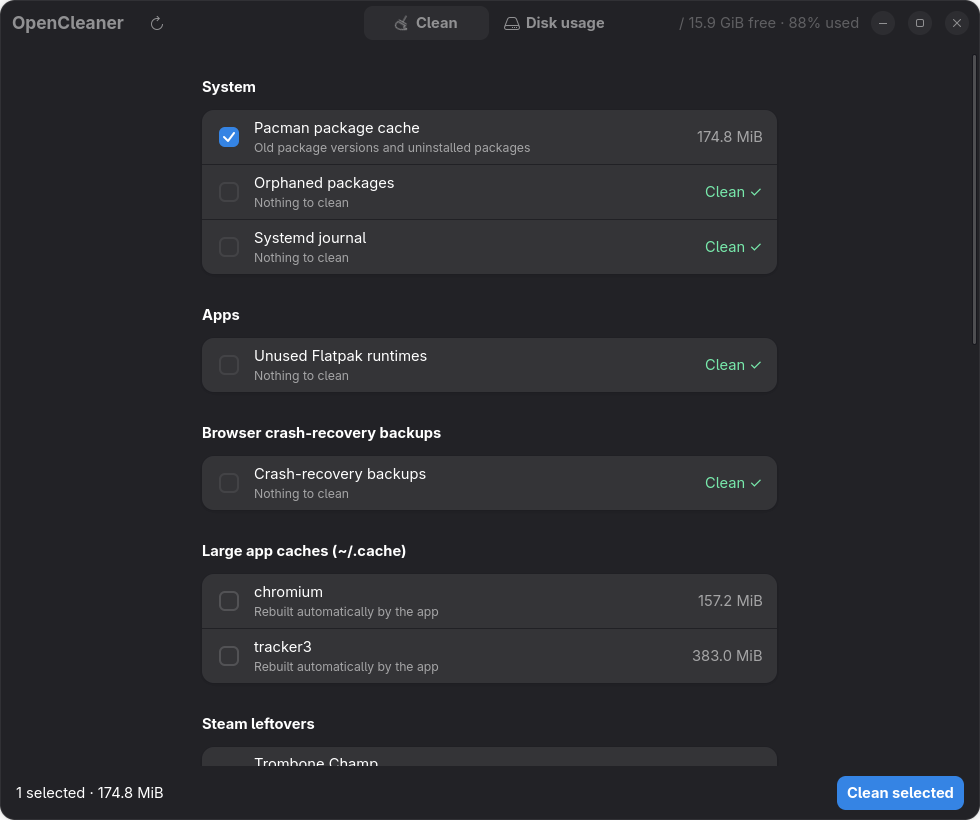
  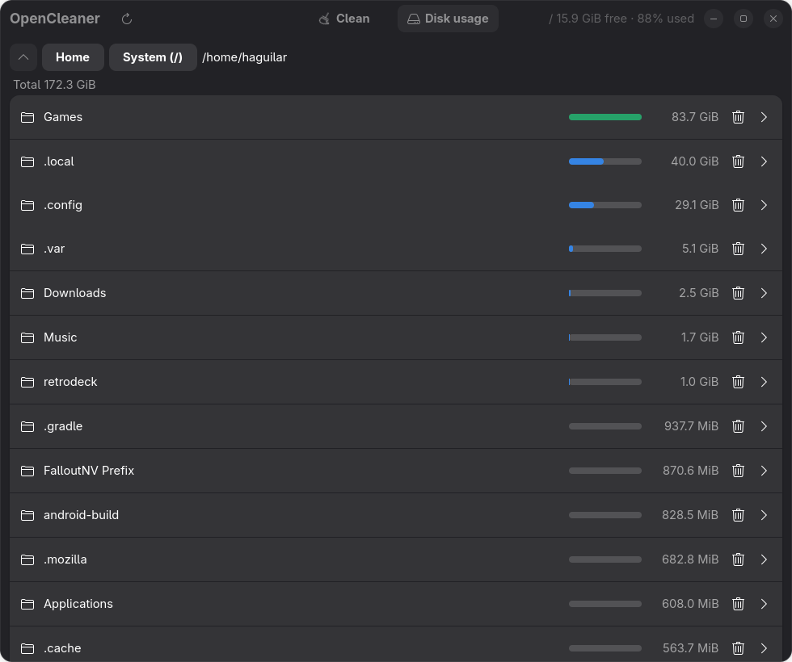

macOS (`macos/`):

  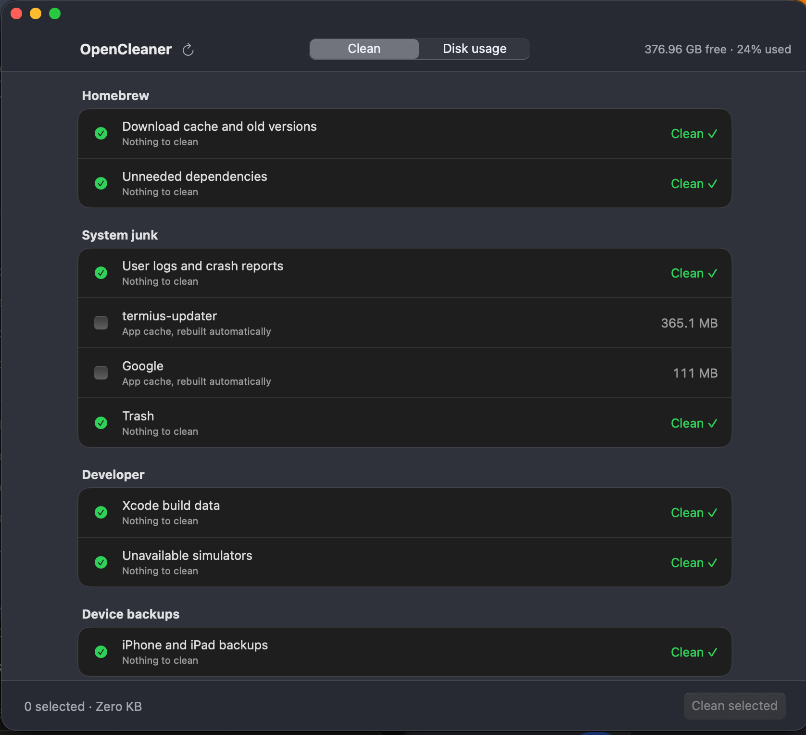
  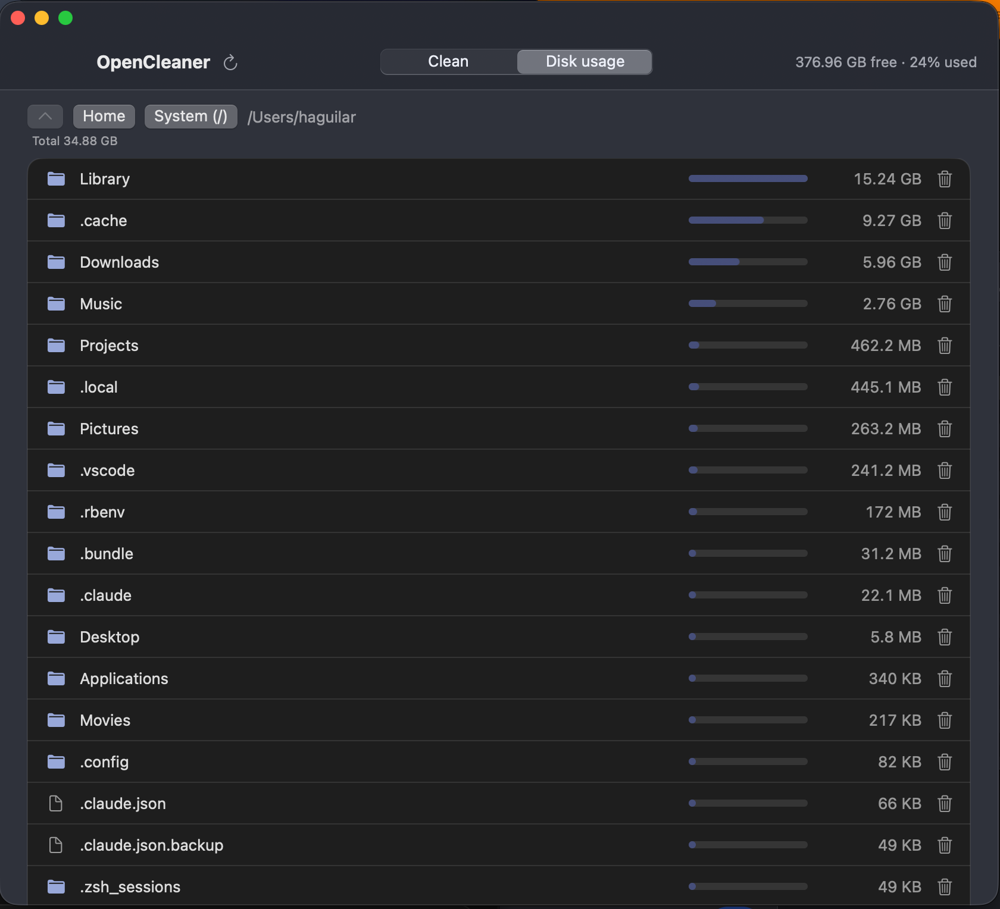

Android (`android/`):

  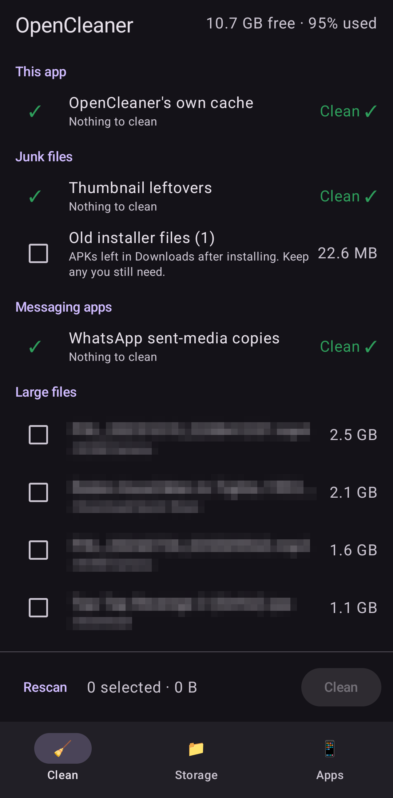
  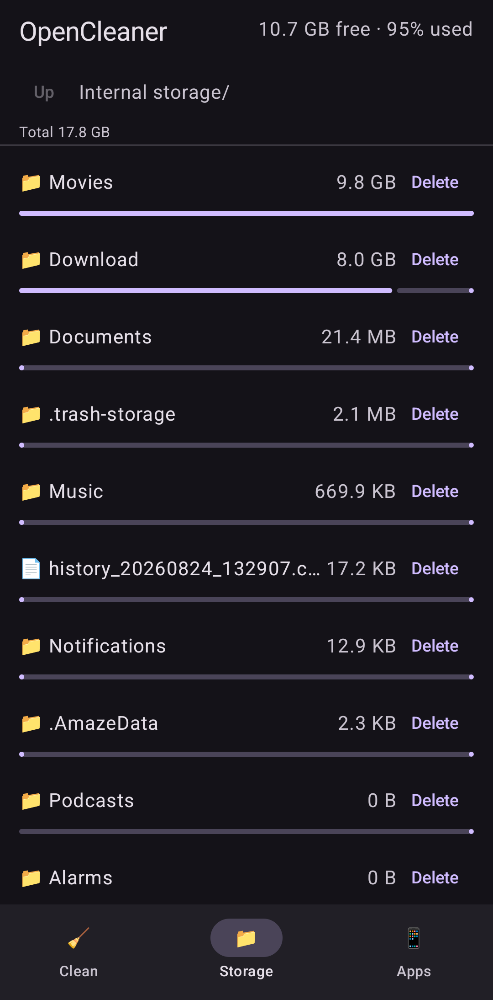
  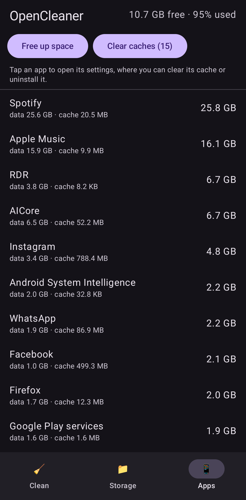

Windows, WinUI 3 (`windows-winui/`):

  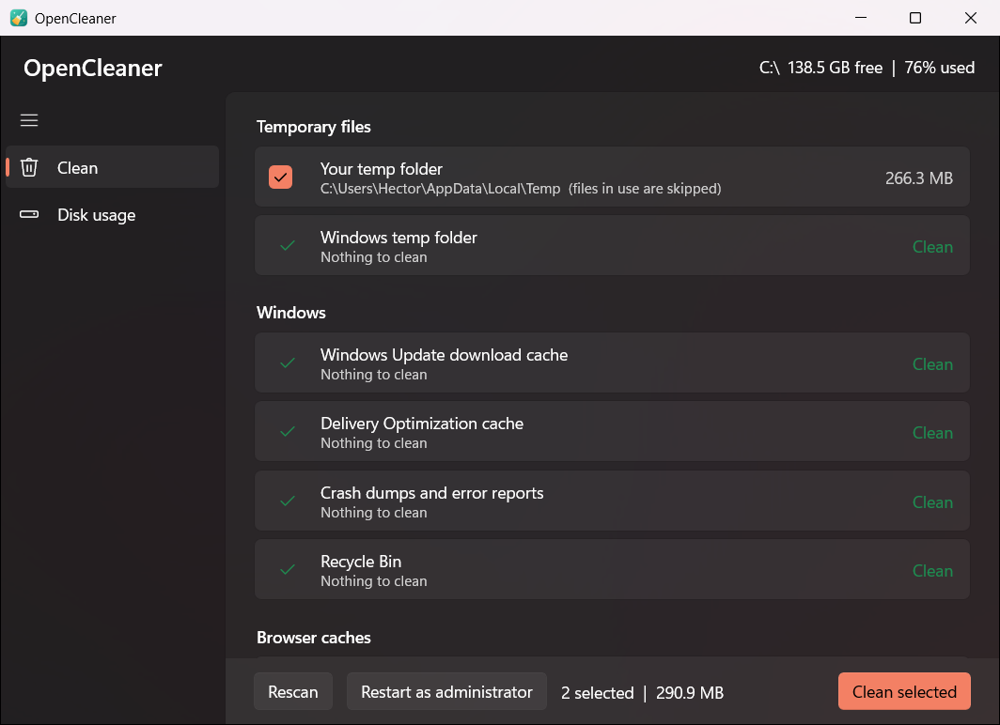
  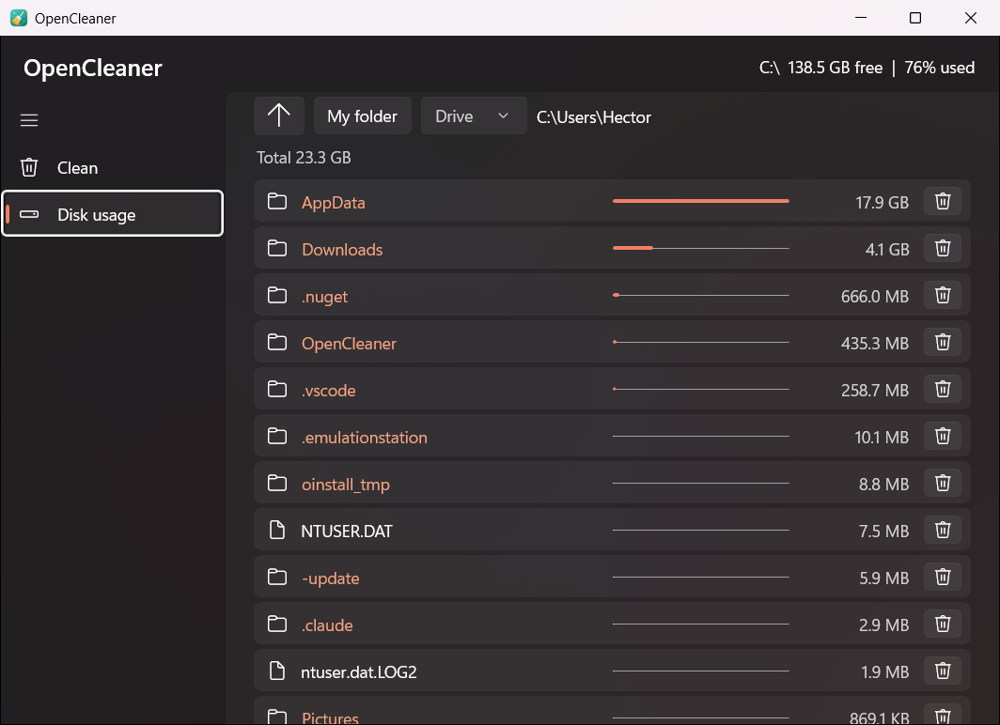

Windows, WinForms (`windows/`):

  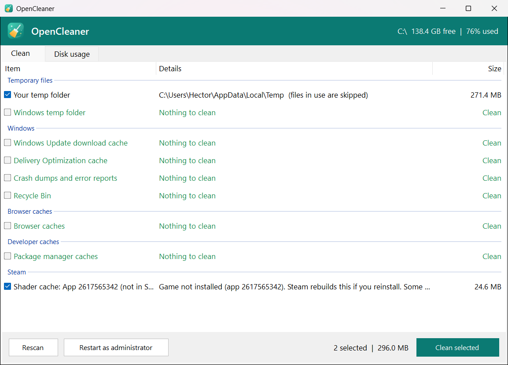
  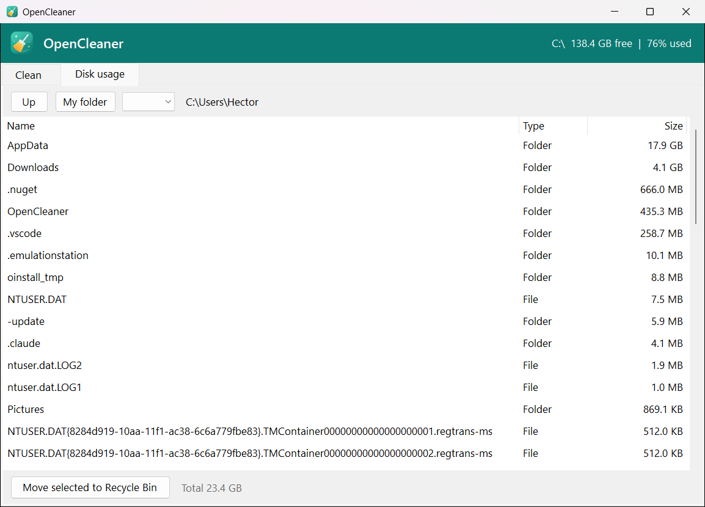

## What they clean

- **Linux:** pacman cache and orphans, systemd journal, unused Flatpak runtimes, browser
  crash-recovery backups, large `~/.cache` folders, Trash, leftover Steam Proton prefixes.
- **macOS:** Homebrew, logs, app caches, Trash, Xcode data, simulators, iOS backups, Steam.
- **Android:** own cache, thumbnails, old APKs, WhatsApp sent copies, large files, per-app sizes
  (limited by what Android allows without root).
- **Windows:** temp folders, Windows Update cache, crash dumps, Recycle Bin, browser caches,
  developer caches, Steam.

## Safety

- Nothing is deleted until you tick items and confirm.
- Each item can only delete inside its own allowed folders; anything else is refused.
- Files in use are skipped, never forced.
- The disk-usage tabs only move items to the Trash / Recycle Bin.
- Items that might hold something you want (save-game prefixes, device backups, orphaned
  packages, caches of running apps) start unticked.

## Status

| App | Status |
|---|---|
| Linux | Run and tested on CachyOS (GNOME) |
| macOS | Builds on a Mac (macOS 13+); cleaning flows not fully tested yet |
| Windows (WinForms) | Runs and scans on Windows 11; cleaning not fully tested yet |
| Windows (WinUI 3) | Builds and runs on Windows 11; cleaning not fully tested yet |
| Android | Runs on a Pixel; features work |

Use at your own risk and read the confirmation list before cleaning. Bug reports and pull
requests welcome.

## License

MIT, see [LICENSE](LICENSE).
